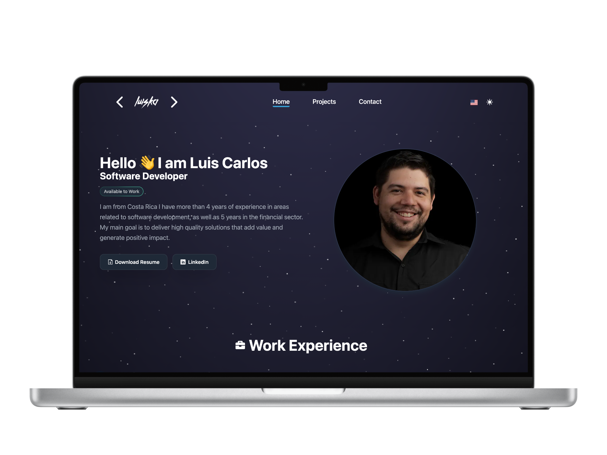

<h1 align="center">Personal Portfolio</h1>

Welcome to my personal portfolio! This repository hosts a collection of projects I've developed throughout my career as a software developer. From interactive web applications to machine learning projects, my portfolio showcases a wide range of skills and expertise in various technological areas.

#### Website: [Link](#)




## Table of  Contents
- [Features](#fatures)
- [Technologies](#technologies)
- [Installation](#installation)


## Features
- About Me: A brief introduction of who I am.
- Work Experience: A timeline of previous work experience.
- Technical Skill: A list of my technical skills.
- Projects: A collection of projects in which I have collaborated with their screenshots and descriptions of each one. 
- Contact: 

## Technologies 
- HTML
- CSS3
- Javascript
- React.js
- Git
- Github

## Installation
To get started with the portfolio application, follow these steps:

1. Clone the Repository:
```bash
git clone https://github.com/luiskacr/Portfolio-2024.git
```

2. Navigate to the Project Directory:
```bash
cd Portfolio-2024
```

3. Install Dependencies:
```bash
npm install
```

4. Start the Development Server:
```bash
npm run dev
```
5. Open the Application:
Once the development server is running, open your web browser and navigate to http://localhost:5173 to view the portfolio.

